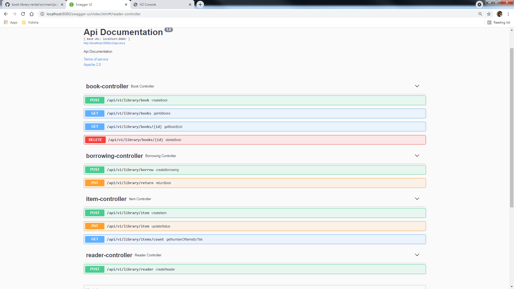
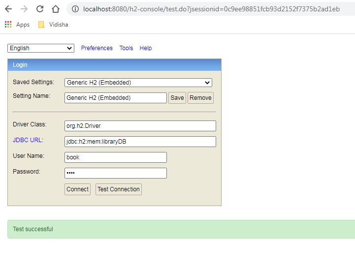
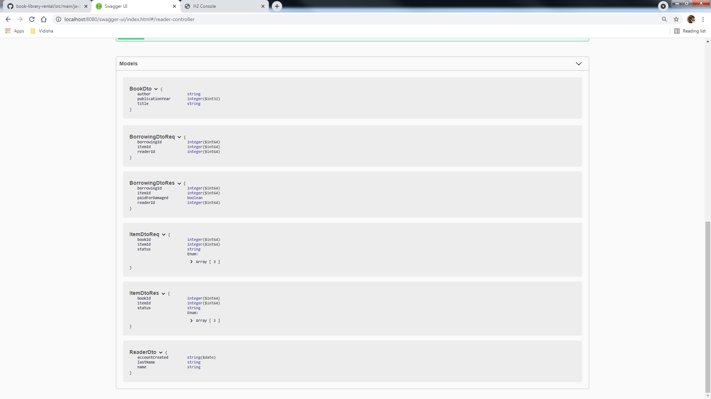

# book-library-rental
This project manages books in the library. It can borrow, reissue books and items provided by user

# DESCRIPTION :
The project is built on Java 11 using maven configuration and Spring boot start up web.
http://localhost:8080/api/v1/books loads the books.
curl -X GET "http://localhost:8080/api/v1/library/books" -H "accept: application/json"
curl -X POST "http://localhost:8080/api/v1/library/book" -H "accept: */*" -H "Content-Type: application/json" -d "{ \"author\": \"Sushil Choudhary\", \"publicationYear\": 0, \"title\": \"sushil's Book\"}"

# Swagger Link:
http://localhost:8080/swagger-ui/index.html#/

# H2 Console Link:
http://localhost:8080/h2-console/
datasource name = libraryDB
username=book
password=book

