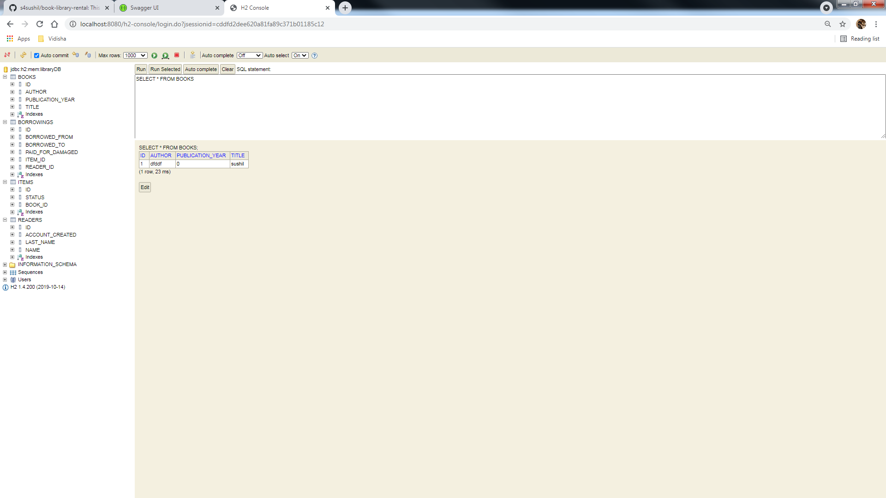

# book-library-rental
This project manages books in the library. It can borrow, reissue books and items provided by user

# DESCRIPTION :
The project is built on Java 11 using maven configuration and Spring boot start up web. 
http://localhost:8080/api/v1/books loads the books.
 
curl -X GET "http://localhost:8080/api/v1/library/books" -H "accept: application/json"
 
curl -X POST "http://localhost:8080/api/v1/library/book" -H "accept: */*" -H "Content-Type: application/json" -d "{ \"author\": \"Sushil Choudhary\", \"publicationYear\": 0, \"title\": \"sushil's Book\"}"
 
 

# Swagger Link:
http://localhost:8080/swagger-ui/index.html#/

# H2 Console Link:
http://localhost:8080/h2-console/
 
datasource name = libraryDB
 
username=book
 
password=book
 

## Swagger Api Docs & Model

 

## H2 Tables

 

## Domain Model

 